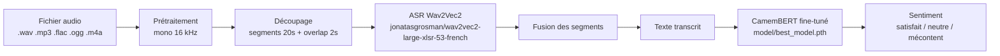

# Speech-to-Text and Customer Call Sentiment Analysis

Système de **transcription automatique d'appels clients** (Speech-to-Text) et **d'analyse de sentiment** en français. Il transforme un fichier audio en texte, puis classifie le sentiment en trois catégories : **satisfait**, **neutre**, **mécontent**.

---

## Table des matières

1. [Vue d'ensemble](#vue-densemble)
2. [Architecture](#architecture)
3. [Structure du projet](#structure-du-projet)
4. [Documentation des fichiers](#documentation-des-fichiers)
5. [Prérequis](#prérequis)
6. [Installation](#installation)
7. [Reproduction et utilisation](#reproduction-et-utilisation)
8. [Cas d'usage](#cas-dusage)
9. [Configuration](#configuration)
10. [Déploiement Docker](#déploiement-docker)
11. [Réentraînement du modèle de sentiment](#réentraînement-du-modèle-de-sentiment)
12. [Limites connues](#limites-connues)
13. [Licence et contribution](#licence-et-contribution)

---

## Vue d'ensemble

Le pipeline traite un appel client en deux étapes :

1. **Transcription (ASR)** — modèle Wav2Vec2 fine-tuné pour le français
2. **Analyse de sentiment** — CamemBERT fine-tuné sur des transcriptions d'appels (3 classes)

Quatre modes d'accès sont disponibles :

| Mode | Fichier | Description |
|------|---------|-------------|
| **CLI complet** | `main.py` | Transcription + sentiment en batch (CSV/JSON) |
| **CLI transcription seule** | `transcriptions/main.py` | Transcription uniquement |
| **API REST** | `api.py` | Endpoint HTTP `/analyze` |
| **Interface web** | `app.py` / `gradio_demo.py` | Démo Gradio interactive |

---

## Architecture

### Schéma global



### Composants principaux

#### 1. Module `transcriptions/` — pipeline ASR

| Fichier | Rôle |
|---------|------|
| `config.py` | Hyperparamètres (modèle, sample rate, découpage, seuils de silence) |
| `preprocessing.py` | Chargement audio via librosa (mono, 16 kHz) |
| `chunking.py` | Découpage en segments avec chevauchement + fusion du texte |
| `model.py` | Chargement et inférence Wav2Vec2 (CTC) |
| `pipeline.py` | Orchestration : prétraitement → découpage → transcription → export |
| `result.py` | Dataclass `ResultatTranscription` |
| `export.py` | Export CSV/JSON des transcriptions |

Modèle ASR par défaut : [`jonatasgrosman/wav2vec2-large-xlsr-53-french`](https://huggingface.co/jonatasgrosman/wav2vec2-large-xlsr-53-french)

Flux de traitement d'un appel (`transcriptions/pipeline.py`) :

```
Fichier audio
  → charger_et_pretraiter()     # mono, 16 kHz
  → decouper_en_segments()      # segments de 20 s avec chevauchement de 2 s
  → modele.transcrire_segment()   # Wav2Vec2 segment par segment
  → fusionner_transcriptions()  # recomposition du texte complet
  → ResultatTranscription
```

#### 2. Module `sentiment.py` — inférence sentiment

- Architecture : CamemBERT (`camembert-base`) + classification 3 classes
- Checkpoint : `model/best_model.pth` (suivi via Git LFS)
- Labels : `mecontent` (0), `neutre` (1), `satisfait` (2)
- Troncature : 256 tokens max

#### 3. Module `sentiment-analysis/` — entraînement

Scripts pour réentraîner le classifieur sur vos propres données CSV (`text`, `label`).

| Fichier | Rôle |
|---------|------|
| `config.py` | Hyperparamètres d'entraînement et mappings de labels |
| `dataset.py` | Chargement et tokenisation des CSV train/val/test |
| `model.py` | Architecture `BertForSentimentClassification` |
| `train.py` | Boucles d'entraînement, validation et évaluation test |
| `utils.py` | Reproductibilité, sauvegarde du meilleur modèle, métriques |

#### 4. Points d'entrée applicatifs

| Fichier | Technologie | Particularités |
|---------|-------------|----------------|
| `main.py` | CLI | Pipeline complet batch, export CSV/JSON final |
| `api.py` | FastAPI | Chargement paresseux des modèles, thread-safe |
| `gradio_demo.py` | Gradio + `@spaces.GPU` | Prévu pour Hugging Face Spaces |
| `app.py` | Gradio | Point d'entrée web (`python app.py`) |

---

## Structure du projet

```
.
├── main.py                    # CLI : transcription + sentiment (batch)
├── api.py                     # API FastAPI
├── app.py                     # Point d'entrée Gradio
├── gradio_demo.py             # Interface Gradio
├── sentiment.py               # Inférence sentiment (CamemBERT)
├── requirements.txt
├── Dockerfile
├── docker-compose.yml
├── model/
│   └── best_model.pth         # Poids fine-tunés (Git LFS)
├── transcriptions/
│   ├── config.py
│   ├── preprocessing.py
│   ├── chunking.py
│   ├── model.py
│   ├── pipeline.py
│   ├── result.py
│   ├── export.py
│   └── main.py                # CLI transcription seule
├── sentiment-analysis/
│   ├── config.py
│   ├── dataset.py
│   ├── model.py
│   ├── train.py
│   └── utils.py
└── examples/
    ├── call_api.py
    └── call_api.sh
```

---

## Documentation des fichiers

Une documentation détaillée de **chaque fichier du projet** (rôle, fonctions, classes, dépendances, fichiers de sortie) est disponible dans :

**[docs/FICHIERS.md](docs/FICHIERS.md)**

---

## Prérequis

- **Python** 3.10+
- **ffmpeg** et **libsndfile** (pour librosa / soundfile)
- **GPU CUDA** recommandé (CPU possible mais lent)
- **Git LFS** pour récupérer `model/best_model.pth`
- ~4 Go RAM minimum ; davantage avec les modèles chargés en mémoire

---

## Installation

### 1. Cloner le dépôt

```bash
git clone https://github.com/<votre-org>/Speech-to-Text-and-Customer-Call-Sentiment-Analysis.git
cd Speech-to-Text-and-Customer-Call-Sentiment-Analysis
```

### 2. Installer Git LFS et récupérer le modèle de sentiment

```bash
git lfs install
git lfs pull
```

Le checkpoint attendu est : `model/best_model.pth`

### 3. Environnement virtuel et dépendances

```bash
python -m venv .venv

# Windows
.venv\Scripts\activate

# Linux / macOS
source .venv/bin/activate

pip install --upgrade pip
pip install -r requirements.txt
```

### 4. Dépendances système

**Ubuntu / Debian :**

```bash
sudo apt-get update
sudo apt-get install -y ffmpeg libsndfile1
```

**Windows :** installer [ffmpeg](https://ffmpeg.org/download.html) et l'ajouter au PATH.

### 5. Téléchargement automatique des modèles Hugging Face

Au premier lancement, les modèles suivants sont téléchargés depuis Hugging Face :

- Wav2Vec2 : `jonatasgrosman/wav2vec2-large-xlsr-53-french`
- CamemBERT : `camembert-base`

Une connexion Internet est requise lors du premier run.

---

## Reproduction et utilisation

### Option A — CLI complet (transcription + sentiment)

```bash
# Un seul fichier
python main.py --input chemin/vers/appel.wav --output resultats/

# Un dossier entier
python main.py --input dossier_appels/ --output resultats/

# Paramètres de découpage personnalisés
python main.py --input appel.wav --output resultats/ --chunk-duration 20 --overlap 2
```

**Sorties produites :**

| Fichier | Contenu |
|---------|---------|
| `resultats/resultats_finaux.csv` | Synthèse : fichier, durée, transcription, sentiment, scores |
| `resultats/resultats_finaux.json` | Détail complet avec scores par classe |
| `resultats/_transcription_brute/` | Fichiers intermédiaires ASR (debug) |

### Option B — Transcription seule

```bash
python transcriptions/main.py --input appel.wav --output resultats_transcription/
```

### Option C — API REST (FastAPI)

```bash
# Lancer le serveur
python api.py

# Ou via uvicorn
uvicorn api:app --host 0.0.0.0 --port 8000
```

**Endpoints :**

| Méthode | Route | Description |
|---------|-------|-------------|
| `GET` | `/` | Informations et routes disponibles |
| `GET` | `/health` | Health check |
| `POST` | `/analyze` | Upload audio → transcription + sentiment |

**Exemple avec curl :**

```bash
curl -X POST "http://127.0.0.1:8000/analyze" \
  -F "file=@audio/mon_appel.wav" \
  -F "chunk_duration=20" \
  -F "overlap=2"
```

**Exemple Python :**

```bash
python examples/call_api.py
```

**Réponse JSON typique :**

```json
{
  "fichier": "mon_appel.wav",
  "duree_sec": 45.2,
  "transcription": "Bonjour, je suis satisfait de votre service...",
  "sentiment": "satisfait",
  "sentiment_scores": {
    "mecontent": 0.05,
    "neutre": 0.12,
    "satisfait": 0.83
  },
  "erreur": null,
  "segments": [
    {"debut_sec": 0.0, "fin_sec": 20.0, "texte": "..."}
  ]
}
```

### Option D — Interface Gradio

```bash
python app.py
# Interface accessible sur http://localhost:7860
```

Variable d'environnement : `PORT` (défaut : 7860).

---

## Cas d'usage

### 1. Analyse qualité en centre d'appels

Traiter un lot d'enregistrements pour repérer les appels **mécontents** et prioriser les rappels ou escalades.

```bash
python main.py --input dossier_appels/ --output resultats/
```

Le CSV final (`resultats_finaux.csv`) permet de filtrer par sentiment et score.

### 2. Intégration dans un workflow existant

Appeler l'API `/analyze` depuis un CRM, un système de ticketing ou un pipeline ETL après chaque appel enregistré.

```python
import requests

with open("appel.wav", "rb") as f:
    response = requests.post(
        "http://127.0.0.1:8000/analyze",
        files={"file": ("appel.wav", f, "audio/wav")},
        data={"chunk_duration": 20.0, "overlap": 2.0},
        timeout=600,
    )
result = response.json()
print(result["sentiment"], result["sentiment_scores"])
```

### 3. Démo / POC interactif

Utiliser l'interface Gradio pour tester rapidement sur un échantillon d'appels sans écrire de code.

```bash
python app.py
```

### 4. Pipeline de recherche / réentraînement

Utiliser `sentiment-analysis/train.py` pour affiner le classifieur sur vos propres transcriptions annotées, puis déployer le nouveau checkpoint.

### 5. Déploiement conteneurisé

Déployer l'API en production via Docker ou docker-compose, par exemple derrière un reverse proxy.

```bash
docker-compose up --build
```

Le projet est également synchronisé automatiquement vers [Hugging Face Spaces](https://huggingface.co/spaces/LATSOUCK/Speech-Text-Analysis) via GitHub Actions.

---

## Configuration

### Transcription (`transcriptions/config.py`)

| Paramètre | Défaut | Description |
|-----------|--------|-------------|
| `model_name` | `jonatasgrosman/wav2vec2-large-xlsr-53-french` | Modèle ASR Hugging Face |
| `sample_rate` | `16000` | Fréquence d'échantillonnage (Hz) |
| `chunk_duration_sec` | `20.0` | Durée d'un segment (s) |
| `overlap_sec` | `2.0` | Chevauchement entre segments (s) |
| `min_duration_sec` | `0.3` | Durée minimale d'un segment |
| `silence_amplitude_threshold` | `1e-4` | Seuil de détection du silence |
| `extensions_audio` | `.wav, .mp3, .flac, .ogg, .m4a` | Formats acceptés |

Ces paramètres peuvent aussi être passés en ligne de commande via `--chunk-duration` et `--overlap`.

### Sentiment (`sentiment.py`)

| Paramètre | Valeur |
|-----------|--------|
| Modèle de base | `camembert-base` |
| Checkpoint | `model/best_model.pth` |
| `MAX_LENGTH` | 256 tokens |
| Classes | `mecontent`, `neutre`, `satisfait` |

### Variables d'environnement

| Variable | Défaut | Usage |
|----------|--------|-------|
| `HOST` | `127.0.0.1` | Hôte de l'API (`api.py`) |
| `PORT` | `8000` (API) / `7860` (Gradio) | Port du serveur |

---

## Déploiement Docker

```bash
# Build et lancement via docker-compose
docker-compose up --build

# Ou manuellement
docker build -t speech-sentiment-api .
docker run -p 8000:8000 speech-sentiment-api
```

L'API est exposée sur `http://localhost:8000`.

> **Note :** le Dockerfile lance uniquement `api.py`. Pour Gradio, adapter le `CMD` ou ajouter un service dans `docker-compose.yml`.

Le conteneur installe automatiquement `ffmpeg` et `libsndfile1` (nécessaires au traitement audio).

---

## Réentraînement du modèle de sentiment

### 1. Préparer les données

Créer le dossier `sentiment-analysis/data/` avec trois fichiers CSV :

```csv
text,label
"Le client est très satisfait du délai de livraison",satisfait
"Le client se plaint du service",mecontent
"Le client demande des informations",neutre
```

Fichiers attendus :

- `data/train.csv`
- `data/val.csv`
- `data/test.csv`

Labels valides : `mecontent`, `neutre`, `satisfait`

### 2. Lancer l'entraînement

```bash
cd sentiment-analysis
python train.py
```

Hyperparamètres dans `sentiment-analysis/config.py` :

| Paramètre | Valeur |
|-----------|--------|
| `BATCH_SIZE` | 16 |
| `LR` | 2e-5 |
| `EPOCHS` | 5 |
| `MAX_LENGTH` | 256 |

### 3. Déployer le checkpoint

L'entraînement sauvegarde `best_bert_sentiment.pth` dans `sentiment-analysis/`.  
L'inférence attend `model/best_model.pth` à la racine du projet :

```bash
cp sentiment-analysis/best_bert_sentiment.pth ../model/best_model.pth
```

---

## Limites connues

### Langue et domaine

- **Français uniquement** — les modèles sont entraînés / fine-tunés pour le français.
- Optimisé pour des **appels de service client**, pas pour la conversation générale ou d'autres domaines.

### Qualité de transcription

- **Pas de diarisation** — les voix client et agent sont fusionnées en un seul flux textuel.
- **Répétitions aux frontières** — le chevauchement des segments peut produire des mots dupliqués (fusion par simple concaténation dans `chunking.py`).
- **Bruit, accents, débit rapide** — dégradation de la qualité ASR.
- **Segments silencieux** — ignorés via un seuil d'amplitude, ce qui peut omettre des passages très faibles.

### Analyse de sentiment

- Sentiment calculé sur **l'intégralité de la transcription**, sans distinction locuteur.
- **3 classes fixes** — pas de détection fine (colère, frustration, sarcasme, etc.).
- Texte tronqué à **256 tokens** — pour les appels très longs, seule la partie initiale est analysée.
- La qualité du sentiment dépend directement de la qualité de la transcription (erreurs ASR → erreurs de sentiment).

### Performance et infrastructure

- **Chargement lourd au démarrage** — les deux modèles sont chargés en mémoire (plusieurs Go).
- **GPU fortement recommandé** — l'inférence CPU est très lente sur de longs appels.
- **Pas de parallélisation multi-fichiers** dans le CLI — traitement séquentiel.
- L'API traite **une requête à la fois** par instance (pas de file d'attente intégrée).

### Problèmes techniques identifiés

- **`main.py` ligne 17** : `sys.path.insert(0, ... "transcription")` référence un dossier incorrect (`transcriptions` attendu) — peut provoquer des erreurs d'import selon le contexte d'exécution.
- **Nom du checkpoint incohérent** : l'entraînement produit `best_bert_sentiment.pth`, l'inférence lit `model/best_model.pth` — un renommage manuel est requis.
- **`sentiment-analysis/dataset.py`** : fonctions `tokenize` et `load_data` dupliquées.
- **Données d'entraînement absentes** du dépôt — à fournir pour réentraîner.
- **Gradio `@spaces.GPU`** : décorateur Hugging Face Spaces ; peut poser problème en local sans GPU ou sans le package `spaces`.

### Formats et sécurité

- Formats audio limités à `.wav`, `.mp3`, `.flac`, `.ogg`, `.m4a`.
- Pas d'authentification sur l'API — à ajouter en production.
- Pas de limite de taille de fichier côté API — risque de saturation mémoire sur de très gros fichiers.

---

## Stack technique

| Composant | Technologie |
|-----------|-------------|
| ASR | PyTorch, Transformers (Wav2Vec2) |
| Sentiment | CamemBERT (Transformers) |
| Audio | librosa, soundfile, torchaudio |
| API | FastAPI, uvicorn |
| Interface | Gradio |
| Données | pandas, datasets (Hugging Face) |
| Métriques | scikit-learn |
| Conteneurisation | Docker, docker-compose |

---

## Licence et contribution

- **Licence :** MIT
- **Contributions :** fork → branche → pull request

---

## Résumé des commandes

```bash
# Installation
git lfs pull
pip install -r requirements.txt

# Pipeline complet
python main.py -i audio/appel.wav -o resultats/

# Transcription seule
python transcriptions/main.py -i audio/appel.wav -o resultats_transcription/

# API
python api.py

# Gradio
python app.py

# Docker
docker-compose up --build
```

## Contact
Pour toute question ou préoccupation, veuillez nous contacter à l'adresse[biramegueye0901@gmail.com]( mailto:support@example.com).